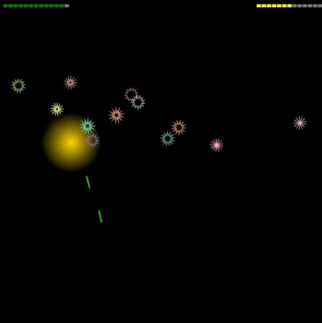

**Tredici Malefici** is a missile defense game where aliens have discovered your phobia of the number 13. To exploit your fear, they drop bombs adorned with 13 spikes. Turn the tables and use this fear to your advantage.

- [Live](https://bacionejs.github.io/tredicimalefici)
- [YouTube](http://www.youtube.com/@bacionejs)

- **Purpose: javascript coding competition for [js13kgames](https://js13kgames.com)**
- Theme: The 2024 theme is Triskaidekaphobia (fear of the number 13)
- Goal: Win the t-shirt prize
- Limitations: Portrait mode only
- Controls: Click/tap
- Tested on: Android phone/tablet (Chrome/Firefox), but it will probably work on anything.

- Download  
  - download index.html
  - open your file manager
  - click index.html to run in your browser
  - click/tap to play

---

### Competition Diary
- Graphics and sound are procedurally generated. For more examples, see [Bacione JavaScript Editor](https://github.com/bacionejs/editor)

#### Day 1
- Finished the core game: bombs, rockets and explosions

#### Day 2
- Changed bombs to random spikiness, rotation and color
- Changed explosions to have gradient fading to the background color. This removes the sharp edges.
- Added status text: health, ammo, score, speed, level
- Added sounds. I already had a rocket sound from my Marslander game, but I needed an explosion sound. I searched for an explosion sound algorithm but wasn't satisfied with what I found. Finally, I discovered that simply adding a lowpass filter and a ramp to my existing rocket sound did the trick.

#### Day 3
- Added a boss -- a UFO with a grinning alien that drops fast bombs. Testers (my family) didn't like the UFO, especially the grinning alien. I wasn't motivated to fix it since I preferred the previous simplicity, so I removed it.

#### Day 4
- Changed status text
  - Removed score and speed
  - Moved level to an inter-level splash screen
  - Changed health and ammo text to graphical bars
- Testers experimented to determine the appropriate difficulty. Besides the minimum value (start) and maximum value (asymptote), I used one extra point and fed it into a logarithmic curve-fitting algorithm.

#### Day 5
- Added victory/philosophical phrases, but the apathetic text-to-speech (TTS) voice made most of them sound ridiculous, so I sadly removed all but two:
  - "Great job"
  - "You were really good"

#### Day 6
- Added a random fast level to break up the monotony.
- The game crashes on older phones after a while, so I fixed the explosion drawing algorithm.
- Experimented with additional sounds and music...

#### Day 7
- Chose a name for the game, made a youtube video, and called it a wrap.

## Summary
This is the biggest game I've ever made, but at 3k it is perhaps too small for this competition. Anyway, I like my game and maybe others will get something out of it.
