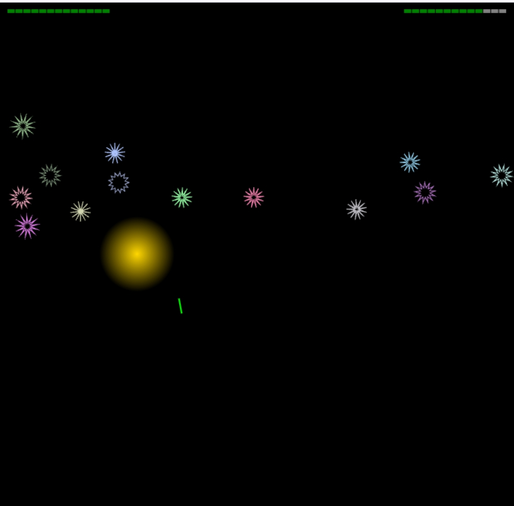

[](https://bacionejs.github.io/tredicimalefici)

## Description
*Tredici Malefici* **(13 evils)** is a missile defense 🚀 javascript game where aliens 👽 have discovered your phobia of the number 13. To exploit your fear, they drop **13 bombs** adorned with **13 spikes**. Turn the tables and use this fear to your advantage.

- Controls: Click/Tap
- Tested on: Android phone/tablet (Chrome/Firefox) in portrait mode.
- Download: The game is one monolithic index.html file with no external dependencies, so it is easy to download and run offline from your file manager in your browser.
- [Live](https://bacionejs.github.io/tredicimalefici)
- [YouTube](http://www.youtube.com/@bacionejs)
- [Code](https://github.com/bacionejs/tredicimalefici)
- [Post-mortem](https://github.com/bacionejs/tredicimalefici#post-mortem)
- [Developer Notes](https://github.com/bacionejs/tredicimalefici#developer-notes)

---

## Purpose
- Competition: [js13kgames](https://js13kgames.com)
- Theme: The 2024 theme is Triskaidekaphobia (fear of the number 13)
- Goal: Win a t-shirt 🏆🎉

---

## Post-mortem

- Day 1: Finished the core game: bombs, rockets and explosions 💥
- Day 2: Added a [lowpass filter and ramp](https://bacionejs.github.io/explosion) *explosion sound* 🔊
- Day 3: Added *health and ammo bars* 🚥
- Day 4: Added a [logarithmic curve-fitting algorithm](https://bacionejs.github.io/difficultyalgorithm) for *level difficulty* 📈
- Day 5: Added *text-to-speech* (TTS) 🗣️
- Day 6: Added random 😈
- Day 7: Chose a name for the game and made a *youtube video*
- Day 8: Added intro

and... 🎬

Making this game was 🥳
I learned how to use *sin, cos, PI, hypot, atan2, pow, lowpass, ramp, tts and curve-fitting* 📚
Graphics and sound were *procedurally generated*. For more examples, see [Bacione JavaScript Editor](https://github.com/bacionejs/editor) 🫦

The game is small, mainly because my Bacione editor on mobile isn’t designed for large projects, but also because I like simplicity.[^1]

I was at first lost about what to code for the 2024 theme *Triskaidekaphobia* (fear of the number 13). While the 2023 theme *13th Century* seemed easier to have ideas about, what can you do with a phobia? I researched Triskaidekaphobia and dozens of phobias and still nothing came to mind…

Previous games I made didn’t use standard game algorithms, so I wanted to try learning them. I've never used `hypot`, `sin`, `cos`, `atan`, etc. Those functions just all sounded so CPU intensive, and I’m a minimalist, right? For Marslander I simply did `y > mountain[floor(x)]` and for Ski `x - skier < tree && tree < x + skier`.[^1]

I started out with JavaScript Classes, but eventually refactored to use function closures… because they are more beautiful. It is pleasantly weird how the closure remembers the variables in the scope it was returned from. I pushed hard to keep my global variables to a minimum, generalize functions, and add some to my library.

If you read my code you might be alarmed at the formatting. Since I program on mobile, screen real estate is at a premium. White-space is for `&&`, `||`, and multi-line blocks, either vertical (outside) or horizontal (inside), but not both. Horizontal white-space is 2 spaces and vertical-whitespace is 1 blank line, except for large blocks which have 9 blank lines. Why are `&&` and `||` the only special characters than I wrap with white-space? Because they are the only ones that blend in with alphanumeric characters, making them hard to spot.

My programs are always one monolithic file with no external dependencies. This is because Bacione is designed to run without a server, offline on Android from your file manager in your Chrome browser. I don't have a computer and at one point my solar panel was too small to charge anything bigger than a mobile device. I struggled for a while with various mobile editors but found Neovim with Apache on Termux to be the best.[^2] But vim-motions are difficult while thumb typing on mobile. Plus I wanted to remove the server. Thus, Bacione was conceived on a remote pacific island with sparse internet, where 90% of people don't have internet or a computer. I had hoped to make Bacione in a few weeks, but months later, by the time it was finished, my daughter had lost interest in programming. Nowadays she draws. So, not wanting it to be a waste, I've tried to spread the news.

Sooo, since I use monolithic files, I only use procedurally generated graphics and sound. It was borne of necessity but I enjoy it. There is just something intrinsically appealing about vector graphics and sound generation.

I don't like being unoriginal but I enjoy making games based on older designs. I've never done a shooting game so that was at the top of my list. But I didn't want complex controls. For example, the Asteroids’ ship is very difficult to control on mobile. So, what about a stationary ship? Well, that is sort of a missile defense game.

I didn't want to spend more than a week on the game, and I'm not very good, so the game is very small. But it is beautiful and fun. Although, it could use some hectic overload to get your heart rate up or cause some rage. But alas, we have a pleasant shooter, with pleasant explosions and neon vector graphics that look like candy. There IS a random boss that is an initial shock but after a couple times you have him figured out. Amidst the fantasia, a voice randomly pipes in about how well you are doing.

I spent many hours creating dozens of victory and philosophical phrases, gleaned from dozens of philosophical works and massaged them to be short and pithy. I had just bought my daughter Meditations by Marcus Aurelius and she hadn't touched it, so I conspired to put philosophy in a game. I'm too clever. Anyway, they sounded ridiculous when spoken by the blasé text-to-speech voice. So alas, there remain but three, philosophy-free. Time wasted.
> "It is not that we have a short time to live, but that we waste a lot of it."  
> — **Seneca**, *On the Shortness of Life*

Surprisingly, I spent a large amount of time on one line of code: the logarithmic curve-fitting formula for level difficulty. Now, this might seem like an obvious formula to you, but it was a breakthrough for me. I assume everybody uses something like it to increase a game's difficulty. I was so enamored by the idea, and it seems so fundamental to gaming, that I dedicated a whole repository to it. [^3]

Also, surprisingly, I spent a lot of time looking for an explosion sound. Part of the problem is that when doing Google searches, the overwhelming number of links are audio files or libraries. Even when searching “procedurally generated,” or some variant of that, I still struggled finding anything. And the libraries that I did find were complex. I just wanted a snippet that was less than 5 lines. So I consulted ChatGPT. We had many long discussions. We were both patient and kind, but we gained little ground. At one point, it did suggest lowpass and ramp but the HTML page it produced didn't sound anything like an explosion. I even had it produce a page with several sliders so I could tweak the parameters live. Still no luck. Part of the problem is that overlapping ideas can hide the solution. And I was too lazy to learn enough about this particular topic to understand what I was doing. I was poking in the dark. So, once again I dedicated an entire repository to it.[^4] I even submitted it in Google Console to ensure the love spreads a little quicker.

In the beginning, I started with a text status which included score, level, health, ammo, and speed. But after most debugging was completed, I really didn't need score and speed. Besides, level is a sufficient gauge of progress. Also, it isn't necessary to see the level value until the level is finished, so I moved that to the inter-level splash screen. Three down, only two left, health and ammo, and well, isn't that the standard anyway? And shouldn't they be graphical? Standard right? I need to stop being so minimalistic. I generalized the function enough to shoehorn into my library. Also, if you look close enough you will see a simple optimization. I hate bothering the CPU.

When I added a glass dome as the starbase, it always seemed like there should be a party going on inside; a rave:
>souls dancing  
>lost in good memories  
>with their brothers in arms  
>blue light pulsing to the rhythm  
>extending outward to the glass dome  
>shimmering with a hint of cosmic rays  

Games sometimes prompt me to think about real life. After making the starbase, it made me think about war. What do people do besides preparations before battle. Spend time with loved ones? Party? What are their thoughts? The creative process for writing the poem was to capture some of those sentiments. First, it started out as a longer story, then serendipitously ended up as a short poem in the shape of a dome.

I've used chatgpt during the whole process of making this game and this poem is the only thing it *didn't* help me with. I was a poet before I started learning programming, and that is part of what attracts me to programming: creating with words. But, I will admit, it does seem like AI could have written my poem. Will I ever read a poem again without wondering if it is AI?

I was born mischievous, and that is reflected in my interactions with chatgpt. I can only hope that Terminator has a sense of humor. But dictators typically don't like being roasted:
>me: chatgpt, produce a short sample of music in base64  
>chatgpt: it is very long, are you sure you want all of it?  
>me: yes, of course  
>... a few moments later  
>me: hey chatgpt, did you just fart  
>chatgpt: grrrr 

Another convo with chatgpt:
>me: Can I copyright your output  
>chatgpt: Only if you make a significant contribution  
>me: So your output has to be crappy enough that I would need to make a significant contribution  
>chatgpt: grrrr  

The music is inline base64 that will make you want to stand up and dance. By adding a fade in/out it doesn't glitch in a loop. The pulsing neon blue of the rave is an alpha adjusted gradient loop on canvas. A more obvious choice is css animation but I do everything on canvas for consistency.

Now, I must say that I am horrified when people don't include a screenshot in their repository. So that was part of wrapping things up. Also, it is helpful to have a YouTube demo. And it is so simple to set up a live link via GitHub Pages, so why wouldn't anybody do that too?

Normally, I do a screen recording on my phone and then copy it to my tablet where I crop it with ffmpeg. But in the future, I plan to use a wrapper page that simulates a phone's dimensions so it can all be done on the tablet.

I’m tempted to do a tutorial like I did for Ski and Marslander.[^5] I wrote a JavaScript app which semi-automatically generates tutorials. And, perhaps I should put the generator in a repository for others to use. I also have a generator for YouTube demos. So the toolbox of utilities seems to keep growing. Isn't that always the case?

## Developer Notes
### Bytebeat Music Version #1
This JavaScript code generates audio using a bytebeat formula and allows for various controls such as generating the audio, playing it once, looping it, and downloading it as a `.wav` file. 

- **Bytebeat Formula**: The core of the sound generation relies on the bytebeat function, which takes a time value `t` and applies a mathematical expression to produce a sound signal.
  
- **Audio Buffer**: The code creates an `AudioBuffer` that stores the generated sound samples. The buffer is then connected to an `AudioContext` to allow playback.
  
- **Controls**:
  - `Generate`: Fills the audio buffer with the sound generated by the bytebeat formula.
  - `Play Once`: Plays the generated sound one time.
  - `Loop`: Plays the generated sound continuously in a loop.
  - `Stop`: Stops any playing or looping audio.
  - `Download`: Converts the generated sound into a `.wav` file format and allows it to be downloaded.

```javascript
onload = () => {
    const audioContext = new AudioContext();
    const generateButton = createButton("Generate");
    const playOnceButton = createButton("Play Once");
    const loopButton = createButton("Loop");
    const stopButton = createButton("Stop");
    const downloadButton = createButton("Download");

    document.body.append(generateButton, playOnceButton, loopButton, stopButton, downloadButton);

    const sampleRate = 8000;
    const duration = 4.1;
    const bufferSize = sampleRate * duration;
    const bytebeat = t => ((((t * ((0x64 >> ((t >> 13) & 15)) & 15)) / 4) * ((0x59 >> ((t >> 11) & 63)) & 1)) & 64) | (t >> 4) | ((t * (42 & (t >> 10))) & 32);

    let audioBuffer, bufferSource, loopSource;

    const generateAudio = () => {
        const buffer = new Float32Array(bufferSize);
        for (let t = 0; t < bufferSize; t++) {
            buffer[t] = (bytebeat(t) & 255) / 128 - 1;
        }
        audioBuffer = audioContext.createBuffer(1, buffer.length, sampleRate);
        audioBuffer.copyToChannel(buffer, 0);
    };

    const playAudio = (loop = false) => {
        bufferSource = audioContext.createBufferSource();
        bufferSource.buffer = audioBuffer;
        bufferSource.loop = loop;
        bufferSource.connect(audioContext.destination);
        bufferSource.start();
    };

    const stopAudio = () => {
        if (bufferSource) bufferSource.stop();
        if (loopSource) loopSource.stop();
    };

    const createWav = () => {
        const headerSize = 44;
        const fileSize = bufferSize * 2 + headerSize;
        const wavBuffer = new Uint8Array(fileSize);
        const header = new DataView(wavBuffer.buffer);

        // RIFF header
        header.setUint32(0, 0x52494646, false); // 'RIFF'
        header.setUint32(4, fileSize - 8, true); // File size
        header.setUint32(8, 0x57415645, false); // 'WAVE'
        header.setUint32(12, 0x666d7420, false); // 'fmt ' chunk
        header.setUint32(16, 16, true); // Sub-chunk size (16 for PCM)
        header.setUint16(20, 1, true); // Audio format (1 = PCM)
        header.setUint16(22, 1, true); // Number of channels
        header.setUint32(24, sampleRate, true); // Sample rate
        header.setUint32(28, sampleRate * 2, true); // Byte rate
        header.setUint16(32, 2, true); // Block align
        header.setUint16(34, 16, true); // Bits per sample
        header.setUint32(36, 0x64617461, false); // 'data' chunk
        header.setUint32(40, bufferSize * 2, true); // Data size

        // Audio data
        for (let i = 0, j = headerSize; i < bufferSize; i++, j += 2) {
            const sample = Math.max(-1, Math.min(1, audioBuffer.getChannelData(0)[i]));
            const intSample = sample < 0 ? sample * 32768 : sample * 32767;
            header.setInt16(j, intSample, true);
        }

        return wavBuffer;
    };

    generateButton.onclick = generateAudio;
    playOnceButton.onclick = () => playAudio();
    loopButton.onclick = () => playAudio(true);
    stopButton.onclick = stopAudio;
    downloadButton.onclick = () => {
        const wavFile = createWav();
        const blob = new Blob([wavFile], { type: "audio/wav" });
        const link = document.createElement("a");
        link.href = URL.createObjectURL(blob);
        link.download = `bytebeat_${Date.now()}.wav`;
        link.click();
    };

    function createButton(text) {
        const button = document.createElement("button");
        button.innerText = text;
        return button;
    }

}
```

### Bytebeat Music Version #2
This is another way of formatting RIFF
```javascript
onload=()=>{

function jam(){
let bytebeat=(t)=>((((t*((0x64>>(((t>>13)&15)*4))&15))/4)*((0x59>>((t>>11)&63))&1))&64)|(t>>4)|((t*(42&(t>>10)))&32);
let q=8000,end=4.1;
let a=     Array.from({length:q*end},(_,i)=>(bytebeat(i)&0xFF)*256);
let b=(n)=>Array.from({length:4}    ,(_,i)=>(n>>(i*8))  &0xFF);
let wav=[].concat(
  [..."RIFF"]    .map(c=>c.charCodeAt(0)),b(36+a.length*2),
  [..."WAVEfmt "].map(c=>c.charCodeAt(0)),b(16),[1,0],[1,0],b(q),b(q*2),[2,0],[16,0],
  [..."data"]    .map(c=>c.charCodeAt(0)),b(a.length*2),
  a.flatMap(v=>[v&0xFF,(v>>8)&0xFF])
).map(v=>`%${v.toString(16).padStart(2,'0')}`).join('').toUpperCase();
return`data:audio/x-wav,${wav}`;
}

let e=document.body.appendChild(document.createElement("button"));
e.textContent="Download";
e.addEventListener('click',function (){
  let wav=jam();
  let link=document.createElement('a');
  link.href=wav;
  link.download=`jam${Date.now()}.wav`;
  link.click();
});

}
```

### Bytebeat Music Version #3
In the code above, the RIFF (Resource Interchange File Format) code is responsible for exporting the generated audio as a WAV file. However, this functionality is unnecessary in real-time sound generation for immediate playback.
```javascript
onload=()=>{

function jam(c){
let b=t=>((((t*((0x64>>((t>>13&15)*4))&15))/4)*((0x59>>(t>>11&63))&1))&64)|(t>>4)|((t*(42&(t>>10)))&32);
let r,t,o=8000,u=2.1,v=o*u,w=new Float32Array(v);
for(t=0;t<w.length;w[t++]=(b(t)&255)/128-1);
let e=c.createBuffer(1,w.length,o);
r=e.getChannelData(0);
for(t=0;t<w.length;r[t++]=w[t]);
return e;
}

let e=document.body.appendChild(document.createElement("button")),a=null,s=null;
e.textContent="Play";
e.addEventListener('click',function (){
  if(!a||a.state==="closed"){
    a=new AudioContext;
    let b=jam(a);
    s=a.createBufferSource();
    s.buffer=b;
    s.connect(a.destination);
    s.loop=true;
    s.start();
    e.textContent="Stop";
  }else{
    s.stop();
    a.close();
    e.textContent="Play";
  }
});

}
```
#### Note
- Version #1 was written by Chatgpt based on this prompt:  
>create javascript.  
>buttons: generate, play once, loop, stop, download  
>purpose: produce a pcm wav  
>settings: 16-bit, 8kHz, mono, duration 4.1  
>downloads: jam_timestamp.wav  
>bytebeat: let bytebeat=(t)=>((((t*((0x64>>(((t>>13)&15)*4))&15))/4)*((0x59>>((t>>11)&63))&1))&64)|(t>>4)|((t*(42&(t>>10)))&32);  

- Version #2 was many hours of refactoring  
- Version #3 was chatgpt codegolfing off its first version  


### How to Create Music with BandLab:
1. **Open BandLab**:
   - Click **+**, go to **Looper**, and select **4am Techno**.

2. **Record the Track**:
   - Click **Record**. After 3 seconds, stop the recording and close the view to access the editing screen.

3. **Trim the Track**:
   - Move the time bar to a good trim point.
   - Tap the track, click **Split**, then select the unwanted portion and click **Delete**. Repeat for the start of the track.

4. **Add Fades**:
Adding fades is crucial to avoid a popping sound. Ensure the beginning and end of the track are either at zero or on the same note.
   - Tap the track, select **Fade**, and adjust the slider to create a millisecond of fade-out at the end.
   - Repeat the process to add a fade-in at the start.

5. **Export the Track**:
   - Long-press the left side of the track, and select **Export** to **M4A**.

6. **Convert and Embed the Audio**:  
Most people won't need the base64 step, but I'm **monolithic**.
   - Compress the file (30k to 3k) using `ffmpeg` and convert it to Base64 format:
     ```bash
     ffmpeg -i input.m4a -ar 8000 -ac 1 -b:a 8k -f mp3 pipe:1 | base64
     ```
   - Paste the Base64 string into the HTML

7. **Set Up Audio Looping in JavaScript**:
   - In JavaScript, set the audio context buffer source to `loop=true`.


[^1]: [Bacione JavaScript Editor](https://github.com/bacionejs/editor)
[^2]: [Neovim with Apache on Termux](https://github.com/bacionejs/termux)
[^3]: [Logarithmic Curve-Fitting for Level Difficulty](https://bacionejs.github.io/difficultyalgorithm)
[^4]: [Explosion Sound Generation](https://bacionejs.github.io/explosion)
[^5]: [Ski/Marslander Tutorial](https://bacionejs.github.io/editor/Games.pdf)
